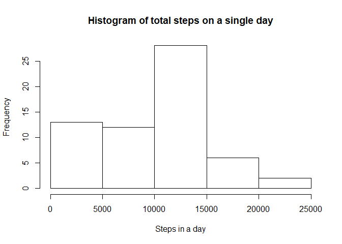
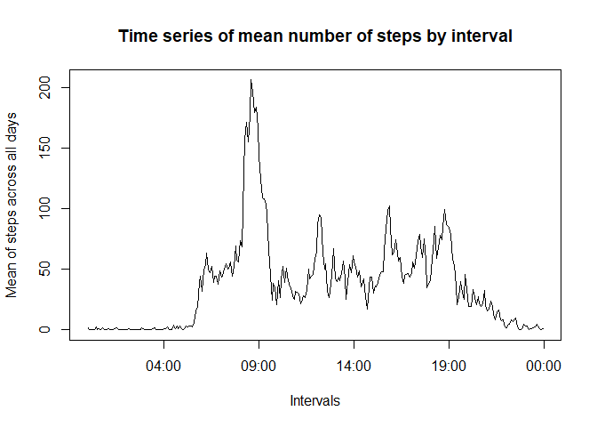
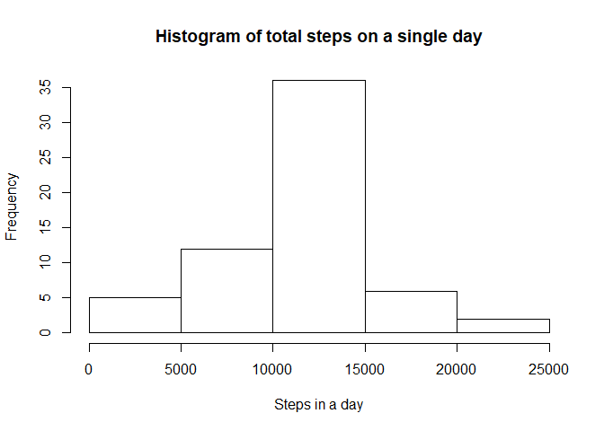
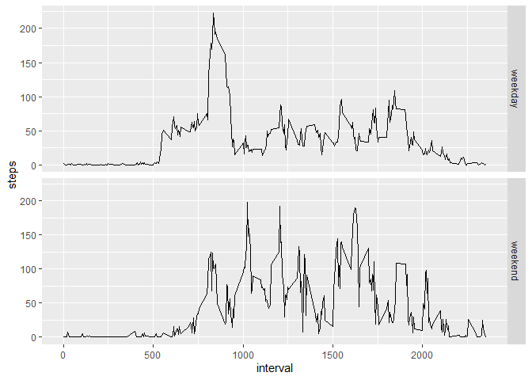

# Activity monitoring analysis

This is an analysis of the data frame "activity monitoring", which counts the number of steps taken by a person for two months. The steps were counted by 5-minute intervals along the whole days.

## Loading the data

First, we have to load the data into an R data frame:


```r
master <- as.character(unzip("activity.zip", list = TRUE)$Name)
df <- read.csv(unz("activity.zip", "activity.csv")) 
```

## Mean of total steps taken by day

Now we turn to the question of what is the mean of the total steps taken by day. First, we make a table to sum the steps taken on every interval during each day:


```r
steps_day<-with(df,tapply(steps,date,sum,na.rm=TRUE))
```

With these table, we plot a histogram of the total number of steps by day:


```r
hist(steps_day,xlab="Steps in a day",main="Histogram of total steps on a single day")
```

<!-- -->

Then, we can compute the mean of total steps taken by day:


```r
mean(steps_day)
```

```
## [1] 9354.23
```

and the median:


```r
median(steps_day)
```

```
## [1] 10395
```

## Average daily activity pattern

Now we plot a time series in which we see the variation on the number of steps by each 5-minute interval across all the days in the data frame:


```r
library(dplyr)

df<-df%>%
  mutate(hour=floor(interval/100))%>%
  mutate(minute=interval-100*hour)%>%
  mutate(hour.minute=paste(hour,minute,sep=":"),.keep="unused")
mean_int<-with(df,tapply(steps,hour.minute,mean,na.rm=TRUE))
n<-names(mean_int)
n<-strptime(n,format="%H:%M")
newdf<-data.frame(n,mean_int)
newdf<-arrange(newdf,n)
with(newdf,plot(n,mean_int,type="l",xlab="Intervals",ylab="Mean of steps across all days",
                main="Time series of mean number of steps by interval"))
```

<!-- -->

The 5-minute interval which, in average has the most activity across all days is the interval starting at:


```r
library(lubridate)

maxSteps<-max(newdf$mean_int)
maxIndex<-which.max(newdf$mean_int)
max_inter<-ymd_hms(newdf$n[maxIndex])
max_inter<-paste(hour(max_inter),minute(max_inter),sep=":")
max_inter
```

```
## [1] "8:35"
```

and the average number of steps taken in that interval is:


```r
maxSteps
```

```
## [1] 206.1698
```

##Handling missing values

The dataset has the following number of missing values:


```r
sum(is.na(df$steps))
```

```
## [1] 2304
```

We will change this NA values in the data set by replacing them with the mean of the corresponding interval across all days:


```r
df2<-df
for (i in seq_along(df$steps)) {
  if (is.na(df$steps[i])){
    df2$steps[i]=mean_int[df2$hour.minute[i]]
  }
}
```

This is an histogram of the total steps in a single day in the resulting data frame:


```r
steps_day2<-with(df2,tapply(steps,date,sum,na.rm=TRUE))
hist(steps_day2,xlab="Steps in a day",main="Histogram of total steps on a single day")
```

<!-- -->

Now we calculate the mean of steps in a day for this new data set:


```r
mean(steps_day2)
```

```
## [1] 10766.19
```

and its median:


```r
median(steps_day2)
```

```
## [1] 10766.19
```

Notice that both the mean and the median increased with respect to those for the original dataset. Also, the mean and the median are equal for this dataset. That could be because there are several days which are full of NA's, and therefore they are full of means in the new dataset, so that the mean of steps in a day is the total number of steps in several days in the new dataset.

## Activity patterns on weekdays and weekends

Finally we analize the different patterns in the time series plots for weekdays and weekends. First, we add a variable in the data frame that identifies the kind of day:


```r
df<-df%>%
  mutate(day=ymd(date))%>%
  mutate(day=weekdays(day))
for (i in seq_along(df$day)) {
  if (df$day[i]%in%c("s?bado","domingo")){
    df$day[i]="weekend"
  }
  else{
    df$day[i]="weekday"
  }
}
```

Now we take the average of steps taken on each interval across all weekdays and across all weekends:


```r
dfid<-df%>%
  group_by(interval,day)%>%
  summarise(steps=mean(steps,na.rm=TRUE))
```

And here are both plots:


```r
library(ggplot2)
```

```
## Warning: package 'ggplot2' was built under R version 3.6.3
```

```r
ggplot(dfid,aes(interval,steps))+geom_line()+facet_grid(day~.)
```

<!-- -->
